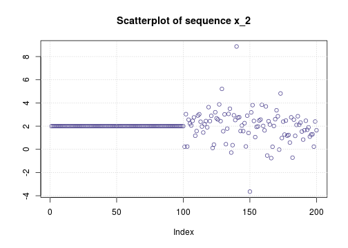

***

# Prompt #
Bratley et al. on page 220 of @guidetosim describe what they call a "_permutation test_" for verifying independence
of a uniform pseudo-random sequence. This method is actually applicable to any continuous distribution,
not just the uniform distribution.
We describe the procedure and implement our version of it in R @theRlang.
We also compare the performance of the test versus the better known "_Ljung-Box Test_" (see
for example pages 206ff of @ruppertfinance).

***

# Description #
Let $\underline{x} = [x_1, x_2,\ldots, x_l]$ be independently sampled from a continuous distribution 
$f_X(\cdot)$, so that the $l$ values are distinct with probability one.
Let $\underline{R} \stackrel{\scriptsize\mbox{def}}{=}
[R_1, R_2,\ldots, R_l]$ be the _ranks_ of data. For instance if $l=3$ and
$$[x_1, x_2, x_3] = [0.48779, 0.08754, 0.42596]\;\;\;\;\mbox{then}\;\;\;\;
[R_1, R_2, R_3] = [2, 3, 1]$$
Clearly the vector $\underline{R}$ is equally likely to be
any one of the $L \stackrel{\scriptsize\mbox{def}}{=}l\,!$ permutations
of the integers $\{1,2,\ldots,l\}$. It thus follows that 
if the iid sample $\underline{x} = [x_1, x_2,\ldots, x_N]$ from continuous $f_X$ is divided into $B \stackrel{\scriptsize\mbox{def}}{=}
\lfloor N/l\rfloor$ subsamples
$$[x_1,x_2,\ldots,x_l],\; [x_{l+1}, x_{l+2},\ldots, x_{2l}],\;
\ldots, [x_{(B-1)l},\ldots,x_{Bl}]$$
and the permutations corresponding to the rank vectors of the subsamples are noted,
then the vector of the numbers of times $[k_1,\ldots,k_L]$ that
each of the $L$ distinct permutations is observed, is multinomially distributed as

(@disth0) $${B \choose k_1,k_2,\ldots,k_L} \left(\dfrac{1}{L}\right)^{k_1} 
\left(\dfrac{1}{L}\right)^{k_2} \cdots \left(\dfrac{1}{L}\right)^{k_L}
={B \choose k_1,k_2,\ldots,k_L} \left(\dfrac{1}{L}\right)^{B}
$$

Equation (@disth0) is the likelihood of the observed permutations under the null hypothesis
$$ {H_0\; :\;\; \underline{x}\;\mbox{is an iid sample from a continuous distribution}}$$

However, the maximum likelihood corresponding to observation $[k_1,\ldots,k_L]$ 
for the multinomial distribution is easily seen to be

(@maxlk) $${B \choose k_1,k_2,\ldots,k_L} \left(\dfrac{k_1}{B}\right)^{k_1} 
\left(\dfrac{k_2}{B}\right)^{k_2} \cdots \left(\dfrac{k_L}{B}\right)^{k_L}
$$

By the Theorem on page 126 of @serfling, if $H_0$ is true, then twice the logarithm of the ratio of the expression
at (@maxlk) to that at (@disth0) is asymptotically distributed as $\chi_{\scriptsize\mbox{df}}^2$ where clearly
the degrees of freedom $\mbox{df}=L-1$. That is
$$ \lambda \stackrel{D}{\longrightarrow}  \chi_{(L-1)}^2 $$
where
$$ \lambda \stackrel{\scriptsize\mbox{def}}{=}
2\left[
\sum_{i=1}^{L} k_i\, \log{(k_i)} - B\, \log{(B)} + B\, \log{(L)}
\right]
$$

Thus we can reject $H_0$ if $\lambda$ exceeds the $95^{th}$ quantile of $\chi_{(L-1)}^2$.

## Choosing the size of subsamples $l$ ##
If we were estimating the probability $p$ of observing a particular permutation, then we would
want the
relative error (the ratio of the standard deviation to the mean) of our estimate to be less than $1/2$;
that is

(@relerr) $$ \sqrt{\dfrac{1-p}{p\,B}} < \dfrac{1}{2} \;\;\;\mbox{so that}\;\;\; 4 < p\, (B+4) $$

Substituting $p = (l\,!)^{-1}$ and $B={N}/{l}$ into expression (@relerr) we obtain

(@bestl) $$ 4\,\left(l\,! - 1\right)\,l < n$$

We found that we have the best power against the alternative when $l$ is the largest
number satisfying inequality (@bestl). 

***

# R implementation #
The function `isIID` implements the procedure discussed above.


```r
require (gtools)
isIID <- function (x, CL=0.95)  {
  bestPerBin <- function (N) {
    s <- 1
    while (s * (4 * factorial (s) - 4) < N) s <- s+1
    ans <- list()
    ans$perBin <- s - 1
    ans$bins <- as.integer (N/ans$perBin)
    ans$perms <- factorial (ans$perBin)
    
    ans$p <- 1/ans$perms
    ans$CI <- sqrt ((1-ans$p)/(ans$p * ans$bins))
    ans
  }
  
  N <- length(x)
  ans <- bestPerBin (N=N)
  
  lu <- defmacro (j, b, expr={
    c((b*(j-1)+1):(b*j));
  })
  
  counts <- list()
  
  for (i in 1:ans$bins) {
    tmp <- x[ lu (i, ans$perBin)]
    tmp <- paste0 (order(tmp), sep='', collapse='')
    if (!(tmp %in% names(counts))) {
      counts[[tmp]] <-1
    } else {
      counts[[tmp]] <- counts[[tmp]] + 1
    }
  }
  
  degfree <- ans$perms-1
  
  one <- 0.0
  two <- 0.0 - ans$bins * log(ans$bins) + ans$bins * log(ans$perms)
  
  for (i in 1:length(counts)) {
    ki <- counts[[i]]
    if (ki != 0) {
      one <- one + ki * log(ki)
    }
  }
  
  result <- list()
  result$df <- degfree
  result$CL <- CL
  result$statistic <- 2 * (one + two)
  result$crit.val <- qchisq (p=CL, df=degfree)
  result$p.val <- 1 - pchisq (q=result$statistic, df=degfree)
  result$reject <- FALSE
  if (result$statistic > qchisq (p=0.95,df=degfree)) {
    result$reject <- TRUE
  }
  
  result
}
```

Now we test the `isIID` function.

```r
rm (list = ls())
source ("./isIID.R")
```
## First test: an IID sequence ##

```r
set.seed (329588)
N <- 200
x1 <- 2 + rt (n=N, df=5)

ans <- isIID (x=x1)
ans <- isIID (x=x1)
if (ans$reject) {
	sprintf ("The test statistic is = %.4f, the %.0f%% critical value is %.4f, reject", 
                  ans$statistic, (100*ans$CL), ans$crit.val)
} else {
	sprintf ("The test statistic is = %.4f, the %.0f%% critical value is %.4f, can NOT reject",
		ans$statistic, (100*ans$CL), ans$crit.val) 
}
```

```
## [1] "The test statistic is = 5.5923, the 95% critical value is 11.0705, can NOT reject"
```

```r
sprintf ("p-value %.4f", ans$p.val)
```

```
## [1] "p-value 0.3479"
```
Our permutation test does not reject $H_0$ for sequence $x_1$. Applying the Ljung-Box test
we get:

```r
print (Box.test (x1, lag=1, type='Ljung'))
```

```
## 
## 	Box-Ljung test
## 
## data:  x1
## X-squared = 0.07478635378, df = 1, p-value = 0.78449123
```
Ljung-Box does not reject $H_0$ for sequence $x_1$ either.

## Second test: half of the data is non-random ##
We create sequence $x_2$ by setting the first half of $x_1$ to $2$.

```r
x2 <- x1
x2[1:(N/2)] <- rep(2,(N/2))
```
 

```r
ans <- isIID (x=x2)
if (ans$reject) {
  sprintf ("The test statistic is = %.4f, the %.0f%% critical value is %.4f, reject", 
           ans$statistic, (100*ans$CL), ans$crit.val)
} else {
  sprintf ("The test statistic is = %.4f, the %.0f%% critical value is %.4f, can NOT reject",
           ans$statistic, (100*ans$CL), ans$crit.val) 
}
```

```
## [1] "The test statistic is = 79.9586, the 95% critical value is 11.0705, reject"
```

```r
sprintf ("p-value %.4f", ans$p.val)
```

```
## [1] "p-value 0.0000"
```
The permutation test rejects $H_0$ for $x_2$ as it should. 
However, the Ljung-Box test fails to reject.

```r
print (Box.test (x2, lag=1, type='Ljung'))
```

```
## 
## 	Box-Ljung test
## 
## data:  x2
## X-squared = 0.2186315071, df = 1, p-value = 0.640084625
```
## Test 3: introducing dependence by filtering ##
Using the [signal package](http://r-forge.r-project.org/projects/signal)
we create sequence $x_3$ by putting $x_1$ through a 
a low-pass single-pole filter so that $x_3$ is AR(1), that is
$$ x_3(n) = (1-c)\,y(n-1) + c\,x_1(n)
\;\;\;\mbox{where}\;\;\; 0 < c <1
 $$
Smaller values of $c$ cause greater dependence on history.
Both tests reject $H_0$ for $x_3$.


```r
library (signal)
c <- 0.1
x3 <- as.vector (filter (filt=c(c), a=c(1,c-1), x=x1))

ans <- isIID (x=x3)
if (ans$reject) {
  sprintf ("The test statistic is = %.4f, the %.0f%% critical value is %.4f, reject", 
           ans$statistic, (100*ans$CL), ans$crit.val)
} else {
  sprintf ("The test statistic is = %.4f, the %.0f%% critical value is %.4f, can NOT reject",
           ans$statistic, (100*ans$CL), ans$crit.val) 
}
```

```
## [1] "The test statistic is = 15.3566, the 95% critical value is 11.0705, reject"
```

```r
sprintf ("p-value %.4f", ans$p.val)
```

```
## [1] "p-value 0.0089"
```

```r
print (Box.test (x3, lag=1, type='Ljung'))
```

```
## 
## 	Box-Ljung test
## 
## data:  x3
## X-squared = 153.345845, df = 1, p-value < 2.220446e-16
```

## Test 4: AR data with less dependence ##
We increase $c$, thus decreasing the history and dependence;
 the permutation test incorrectly fails to reject. However the Ljung-Box test
succeeds at rejecting.

```r
c <- 0.2
x4 <- as.vector (filter (filt=c(c), a=c(1,c-1), x=x1))

ans <- isIID (x=x4)
if (ans$reject) {
  sprintf ("The test statistic is = %.4f, the %.0f%% critical value is %.4f, reject", 
           ans$statistic, (100*ans$CL), ans$crit.val)
} else {
  sprintf ("The test statistic is = %.4f, the %.0f%% critical value is %.4f, can NOT reject",
           ans$statistic, (100*ans$CL), ans$crit.val) 
}
```

```
## [1] "The test statistic is = 8.1799, the 95% critical value is 11.0705, can NOT reject"
```

```r
sprintf ("p-value %.4f", ans$p.val)
```

```
## [1] "p-value 0.1466"
```

```r
print (Box.test (x4, lag=1, type='Ljung'))
```

```
## 
## 	Box-Ljung test
## 
## data:  x4
## X-squared = 118.7751034, df = 1, p-value < 2.220446e-16
```
# Conclusion #
We have identified scenarios where one test succeeds and the other fails.
One can use the present permutation test and the Ljung-Box test together by simply rejecting
the null hypothesis if either test rejects it.

***

# References #
